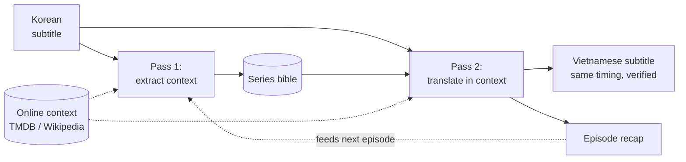

# dramasub

Context-aware drama subtitle translation with local LLMs via Ollama. Tracks
characters, relationships, and address terms per show for consistent
translations — **direct from the source language, no English pivot**.

The default use case is K-Drama (Korean → Vietnamese), but **languages are
configuration, not assumptions** — source and target are set per project.

## How it works

Every show is a **project**: a directory that accumulates context across
episodes (a series bible, a directed address table, a glossary, per-episode
summaries, and cached web context). Translation is **two-pass**:

1. **Pass 1** reads the episode and extracts structured context — who appears,
   who speaks to whom, relationship/speech-level shifts, new terms — and proposes
   bible updates (auto-applied, logged so you can revert).
2. **Pass 2** translates chunk by chunk, using a sliding window of already
   translated lines plus a bible excerpt filtered to that chunk's characters.

The LLM never touches timestamps or structure: subtitles are parsed and
reassembled programmatically, and every write is verified (cue count + every
timestamp must match the source, or the write aborts).



## Why it's different

The hard part of long-form drama is everything *between* the lines — a name that
must read the same in episode 9 as in episode 1, honorifics that don't exist in
the target language, who addresses whom and how. dramasub is built around a
per-show memory that compounds across episodes.

- **Direct from the source, not an English pivot** — stays closer to the original
  meaning, tone, names, even deliberate slurs.
- **Register consistency across a series** — a per-show *bible* plus a **directed
  address table** (Korean speech levels → Vietnamese `anh`/`em`/`cô`/`con`…, where
  A→B may legitimately differ from B→A) is learned in pass 1, hand-correctable,
  and reapplied to every later cue and episode.
- **The model never touches timing or structure** — no desync, no dropped lines.
- **Local, offline, private, free** — runs on your own Ollama, even a 12 GB GPU.
- **Human-in-the-loop** — everything inferred is editable YAML; fix a pronoun or
  term once and it propagates.

It is **not** at parity with a skilled human on polish out of the box, and quality
is bounded by the local model. The honest comparison and limitations live in
[docs/models.md](docs/models.md).

## Requirements

- Python 3.11+
- [Ollama](https://ollama.com) running locally, model pulled:
  `ollama pull gemma4:latest`
- (Optional) a TMDB API key for online context — see [docs/configuration.md](docs/configuration.md#online-context-tmdb)

## Install

```bash
python -m venv .venv && source .venv/bin/activate
pip install -r requirements.txt
python -m dramasub.cli --help
```

## Usage

```bash
# Create a project (defaults: source ko, target vi, model gemma4:latest)
python -m dramasub.cli init ./my-show --title "My Drama" --tmdb-id 123456

# (Optional) fetch online context into the cache — see docs/configuration.md
python -m dramasub.cli context ./my-show --season 1

# Translate an episode (two-pass; -v shows per-chunk progress)
python -m dramasub.cli -v translate ./my-show --episode 1 path/to/E01.ko.srt
#   ...or a fast one-pass draft: add --direct   (see docs/models.md)

# Inspect the accumulated bible (hand-edit the YAML to correct it); re-run QC
python -m dramasub.cli bible ./my-show
python -m dramasub.cli qc ./my-show --episode 1
```

Output lands in `my-show/episodes/e01/`: `source.srt` (copied in, never modified),
`context.yaml` (pass-1 context), `output.srt` (same timing as source), and
`summary.txt` (recap that feeds the next episode).

## Models

The default is **`gemma4:latest`** (8B) — judged best of the models tried in a
blind comparison, and the smallest/fastest (fits a 12 GB GPU). `qwen3.5` and
`qwen3.6` are alternatives. Set with `init --model <name>` or the `model` key in
`project.yaml`. Full comparison, method, translation modes, and limitations:
[docs/models.md](docs/models.md).

## Defaults & customization

dramasub ships a **default K-drama guide and dictionary** (ko→vi) applied
automatically when a project's language pair matches. The dictionary is a
compact, high-signal set — mined from parallel reference subtitles, then pruned
against the target model so only terms it gets *wrong* on its own survive. Bring
your own for another genre or language pair, or generate one with the
[`extract-dictionary`](.claude/skills/extract-dictionary/SKILL.md) skill. See
[docs/dictionary.md](docs/dictionary.md).

Per-project settings live in `project.yaml`; secrets and host in a gitignored
`.env`. Full reference (including the bible and online context):
[docs/configuration.md](docs/configuration.md).

## Design notes

Follows [AGENTS.md](AGENTS.md): `dramasub.core` is a pure, UI-free library (no
prints, typed errors, stdlib logging); `dramasub.cli` is the only place that
prints. Correctness is enforced by runtime self-checks, not a test suite.
Dependencies are limited to `pysubs2`, `requests`, and `PyYAML`.

## License

Released under the [MIT License](LICENSE).
