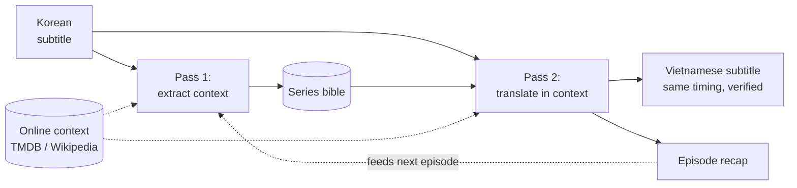

# dramasub

Context-aware drama subtitle translation with local LLMs via Ollama. Tracks
characters, relationships, and address terms per show for consistent
translations.

The primary use case is K-Drama (Korean → Vietnamese), but **languages are
configuration, not assumptions** — source and target are set per project.

## How it works

Every show is a **project**: a directory that accumulates context across
episodes (a series bible, a directed address table, a glossary, per-episode
summaries, and cached web context). Translation is **two-pass**:

1. **Pass 1** reads the episode and extracts structured context — who appears,
   who speaks to whom, relationship/speech-level changes, and new terms — and
   proposes bible updates (auto-applied, logged so you can revert).
2. **Pass 2** translates chunk by chunk, using a sliding window of already
   translated lines plus a bible excerpt filtered to the characters in each
   chunk.

The LLM never touches timestamps or file structure: subtitles are parsed and
reassembled programmatically, and every write is self-checked (cue count and
every timestamp must match the source, or the write aborts).



## Advantages

Pushing subtitles through an LLM line by line is the easy part. The hard part of
long-form drama is everything *between* the lines — a name that must read the same
in episode 9 as in episode 1, honorifics that don't exist in the target language,
who addresses whom and how. dramasub is built around a per-show memory that
compounds across episodes, so that consistency is the default rather than a manual
chore.

- **Translates direct from the source language, not a pivot.** Most fan subs are
  relayed through English, which compounds a second language's drift, reordering,
  and errors. dramasub goes Korean→Vietnamese directly, staying closer to the
  original meaning, tone, names, and even deliberate slurs. Tested against a
  third-party sub that had been pivoted through English, dramasub was *more*
  faithful to the Korean on every episode wherever that pivot drifted (see
  [Models & quality](#models--quality)).
- **The model never touches timing or structure.** Cues are parsed and
  reassembled programmatically; every write is verified against the source (cue
  count + every timestamp) or aborted — no desync, no dropped lines.
- **Register consistency across a series — the part that usually breaks.** A
  per-show *bible* accumulates characters plus a **directed address table**: how
  each person speaks to each other person (Korean speech levels → Vietnamese
  `anh`/`em`/`cô`/`con`…), where A→B may legitimately differ from B→A and shifts
  the moment a relationship does. Learned in pass 1, hand-correctable, and
  reapplied to every later cue and episode alongside a frozen name/term glossary.
- **Local, offline, private, free.** Runs on your own Ollama — even a 12 GB GPU —
  with no cloud, no per-token cost, and subtitles never leaving your machine.
- **Human-in-the-loop by design.** Everything the model infers is editable YAML;
  a reviewer fixes a pronoun or term once and the fix propagates.
- **Language-neutral.** The `ko`→`vi` default is just configuration.

## Limitations

- **Not at parity with a skilled human on polish.** A human sub reads more
  naturally and handles register (pronouns / speech levels) more reliably; out of
  the box the model sometimes defaults to wrong or archaic pronouns until the
  address table is curated.
- **Register and culture-specific terms need review.** Job titles, honorifics,
  and slang can come out wrong on the first pass — the bible and glossary exist to
  fix this, but that is human work.
- **Quality is bounded by the local model.** An 8–35B local model won't match a
  frontier model's fluency; expect occasional mistranslations, code-switching
  (a stray English/Korean/Chinese word — caught and retried), or a hallucinated
  detail.
- **Bigger isn't always better or faster.** The largest model tried (~35B MoE)
  spills off a 12 GB GPU and runs several times slower without beating the 8B
  default on this task (see [Models & quality](#models--quality)).
- **Wordplay and brand slang still need a human.** Puns and in-scene shorthand are
  not reliably reinvented.

## Requirements

- Python 3.11+
- [Ollama](https://ollama.com) running locally, with the model pulled:
  ```bash
  ollama pull gemma4:latest
  ```
- (Optional) a TMDB API key for online context, via `TMDB_API_KEY`.

## Install

```bash
python -m venv .venv && source .venv/bin/activate
pip install -r requirements.txt
python -m dramasub.cli --help
```

## Usage

```bash
# 1. Create a project (defaults: source ko, target vi, model gemma4:latest)
python -m dramasub.cli init ./my-show --title "My Drama" --tmdb-id 123456

# 2. (Optional) fetch online context into the cache — see "Online context" below
export TMDB_API_KEY=...
python -m dramasub.cli context ./my-show --season 1 \
    --wiki-source "<source-edition article title>" --wiki-target "<target-edition title>"

# 3. Translate an episode (two-pass). Use -v to see per-chunk progress.
python -m dramasub.cli -v translate ./my-show --episode 1 path/to/E01.ko.srt

#    ...or a fast one-pass "direct" translate (no pass 1, TMDB context only):
python -m dramasub.cli -v translate ./my-show --episode 1 path/to/E01.ko.srt --direct

# 4. Inspect the accumulated bible (hand-edit the YAML to correct it)
python -m dramasub.cli bible ./my-show

# 5. Re-run quality checks on a translated episode
python -m dramasub.cli qc ./my-show --episode 1
```

Output lands in `my-show/episodes/e01/`:

```
source.srt      original subtitle (copied in, never modified)
context.yaml    pass-1 structured context
output.srt      translated subtitle (same timing as source)
summary.txt     recap that feeds the next episode's context
```

## Configuration

`project.yaml` holds per-project settings — languages, `model`, `num_ctx`,
`keep_alive`, `ollama_host` (the Ollama server URL, default
`http://localhost:11434`), `honorific_policy` (`translate` vs `keep_romanized`),
`loanword_policy` (`keep_english` vs `localize`), `romanization` (`media` vs
`revised`), chunk sizes, per-pass temperatures, and `retry_temperatures` (the
temperatures used by pass-2 retry attempts — hotter retries help the model
escape a stubborn wrong output).

dramasub ships a **default K-drama translation guide and base dictionary** for
Korean→Vietnamese (~140 terms: workplace ranks, kinship/address, harsh
address/insults, interjections, food, romance, and common drama tropes), used
automatically when a project's language pair matches. The guide is injected into
translation prompts; the dictionary sits **under** the show's bible glossary (the
bible always wins) and
is filtered per chunk. Control both via `guide:` and `dictionary:` in
`project.yaml` — `default`, `none`, or a path to your own file, which is how
other genres or language pairs bring their own. The base dictionary informs the
model but is not enforced by QC; only the curated bible glossary is.

A `.env` file in the working directory is loaded automatically (existing
environment wins), so secrets and machine-specific settings can live outside
`project.yaml`. Recognized keys: `TMDB_API_KEY` and `OLLAMA_HOST` (overrides
`ollama_host`; a bare `host:port` gets an `http://` prefix). Keep `.env`
gitignored.

```dotenv
OLLAMA_HOST=http://10.0.0.20:11434
TMDB_API_KEY=eyJhbGci...
```

`bible.yaml` holds characters (each with a **frozen** `target` name rendering so
names never drift between episodes), relationships, a **directed** address table
(the target-language terms a speaker uses for themself and the listener), and a
glossary. Both are human-editable — the tool only appends and updates, never
silently deletes.

Quality features drawn from professional subtitling practice: character names
are frozen on first sight and reused verbatim; pass 1 flags narrators so
commentary is rendered in the third person; and lines over the ~42-char reading
limit are re-requested more concisely rather than truncated.

## Online context (TMDB)

Online context is optional but improves quality a lot (see below). TMDB is the
primary source; supply a credential via the `TMDB_API_KEY` environment variable
(a local `.env` you `source`, or your shell) or `tmdb_api_key` in `project.yaml`.

**Which credential to use.** TMDB's API settings page shows two. Use the
**API Read Access Token** (v4 auth) — the long token beginning `eyJ…`:

```bash
export TMDB_API_KEY="eyJhbGciOiJIUzI1NiJ9...."
```

(The legacy **API Key** — the ~32-char hex string on the same page — also works;
dramasub auto-detects which one you provided.)

Fetched data (series overview, cast, episode synopses, in both source and
target languages) is cached under `<project>/cache/` and reused fully offline;
re-fetch only with `context --refresh`.

## Translation modes: what context buys you

Three ways to run the same episode, from cheapest to richest. Observed on a real
Korean→Vietnamese office drama (examples anonymized with the placeholder name
`홍길동` / *Hong Gil-dong*):

| | One-pass `--direct` | Two-pass, no TMDB | Two-pass + TMDB |
|---|---|---|---|
| Pass-1 analysis / bible | ✗ | ✓ | ✓ |
| Online context | TMDB only | ✗ | ✓ |
| Model calls / episode | ~½× | 1× | 1× + fetch |
| Names | correct **while** in the prompt | **guessed**, e.g. `Hong Gildong` | **official**, `Hong Gil-dong` |
| Cross-episode consistency | none (nothing frozen) | frozen after first sight | frozen from official spelling |
| Register / address | weakest | good | good |
| Full names not in the subtitle | ✗ | ✗ | **recovered from cast** (e.g. a given-name-only line gets its surname) |

What we actually saw:

- **No context** guesses romanizations ad hoc (`Hong Gildong`), occasionally
  mistranslates a job-title term literally (a rank word rendered as
  "responsibility"), and sometimes picks an odd register (an archaic "you").
- **+ TMDB** pins names to the official cast spellings, recovers a surname the
  subtitle never says (the cast list supplies it), fixes the title term, and
  reads more naturally.
- **`--direct`** is the cheapest and still gets names right *while TMDB sits in
  the prompt* — but with no bible it freezes nothing, so consistency isn't
  guaranteed across chunks or episodes, lines run longer, and subtext/register
  are weaker. Good for a fast draft; two-pass + TMDB is best for a finished sub.

(`--direct` is a lightweight one-pass path; the dedicated small-model real-time
mode remains on the backlog per [AGENTS.md](AGENTS.md).)

## Models & quality

The default is **`gemma4:latest`** (8B). In a blind three-judge comparison —
Korean source as the reference, model identities hidden — it was ranked best of
the three models tried, with the highest adequacy and fluency and a clear
majority of per-cue wins, *and* it is the smallest and fastest, fitting entirely
in a 12 GB GPU.

| Model | Size | Fits 12 GB VRAM | Speed | Quality (blind judges) |
|---|---|---|---|---|
| `gemma4:latest` (**default**) | 8B | ✓ fully on GPU | fastest | best — top adequacy + fluency |
| `qwen3.5:latest` | 9.7B | ✓ fully on GPU | fast | decent; some meaning reversals |
| `qwen3.6:latest` | 35B-A3B MoE | ✗ spills to CPU/RAM | slow | strong meaning, but slower, with occasional wrong register / hallucination |

Set the model with `init --model <name>` or the `model` key in `project.yaml`.

What holds across every test, on any of the models:

- **Direct from Korean beats an English pivot.** Scored against the *Korean* — not
  the Vietnamese reference, which was itself relayed through English — the local
  pipeline kept meaning the pivoted reference lost; in one episode the reference
  even followed a mis-aligned English line unrelated to the Korean.
- **Adequacy is near a human team; the gap is polish.** Against a third-party
  **human** sub over 5 episodes, the pipeline's meaning fidelity was near-even
  (~7.0 vs ~7.8 on a 1–10 scale); the human led mainly on fluency and register —
  exactly what the directed address table and glossary exist to close with a
  little curation.
- **The recurring errors are data-fixable.** A wrong pronoun for a relationship, a
  mistranslated job title, or a bit of untranslated slang is fixed once in the
  bible/glossary and inherited by every later cue and episode.

Method: judgments are by stronger models on Korean-source samples (the model
comparison was one episode, blind, three judges; the human-team comparison ran 5
episodes) — directional, not a leaderboard. Speed figures cited here used an RTX
3060 (12 GB) / i3-12100F / 32 GiB on Ubuntu, `num_ctx=16384`, TMDB cached.

<details>
<summary>Historical note — qwen3.5 vs qwen3.6, before gemma4</summary>

The two Qwen models were compared first, over 5 episodes (240 cues) judged
against the Korean. `qwen3.6:latest` scored higher (adequacy 7.7 vs 5.8) but ran
~5× slower because its 35B weights spill off a 12 GB GPU (~12 vs ~58 cues/min,
two-pass), while `qwen3.5:latest` fit fully in VRAM. `qwen3.5` also showed more
meaning reversals and leftover untranslated English. Both are kept as options,
but `gemma4` now supersedes them as the default: faster than qwen3.5 and judged
higher-quality than qwen3.6.
</details>

## Design notes

The project follows [AGENTS.md](AGENTS.md): `dramasub.core` is a pure, UI-free
library (no prints, typed errors, stdlib logging); `dramasub.cli` is the only
place that prints. Correctness is enforced by runtime self-checks rather than a
test suite. Dependencies are limited to `pysubs2`, `requests`, and `PyYAML`.

## License

Released under the [MIT License](LICENSE).
